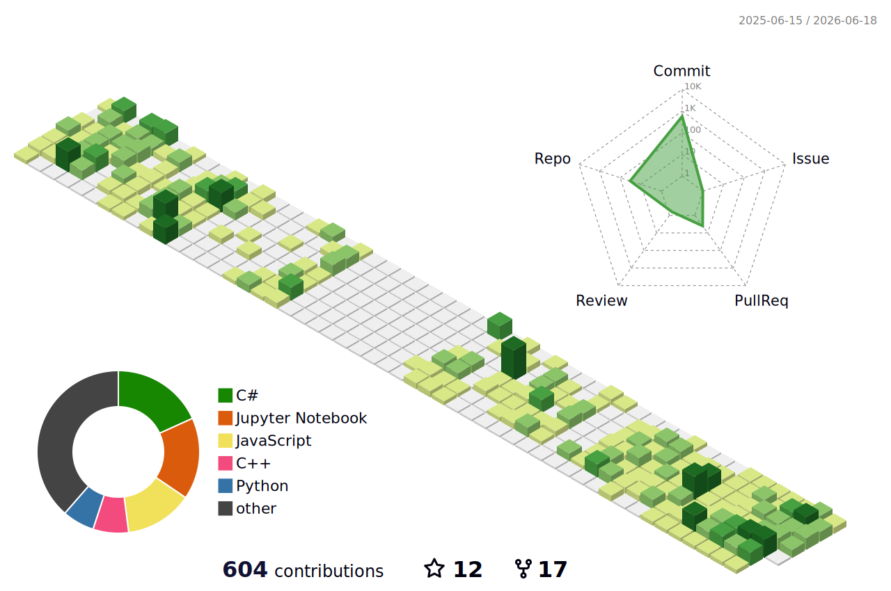

  

## 🌱 My Contribution 3D Graph

## Profile
- `Name` : Sung MyungGun (Hugo)
- `Email` : personar95@naver.com
- 🔭 I'm currently working as an **IoT instructor**
  - Major : C#, Smart Factory, IoT Development
  - Minor : Python, Java, Web Dev(Spring Boot, ASP.NET, etc)
 
## GitHub Stat and Languages
<!-- username은 본인걸로 -->

  

## Using Languages

    
    
    
    
    
    
    
    
    
    
    
    
    

## Using Technics

   
    
    
    
   
   
   
  
  
  
  
  
  
  <!-- 
    
  -->

## Using Tools

  
  
  
  

<!--
## 기술명세
| 기술분류 | 설명 |
|:---:|:---:|
|VSCode | VisualStudio Code 툴 사용법 습득|
|Python | 빅데이터분석, 머신러닝, OpenCV|
-->

## Project List
- [Website] [Personal Portfolio site](https://hugoMGSung.github.io)
- [WinForm] [WinForms프로젝트](https://github.com/hugoMGSung/works-need-it-csharp/tree/main/miniprojects/ITS_CCTV_App)
- [WPF] [WPF프로젝트](https://github.com/hugoMGSung/works-need-it-cshap/tree/main/studyWpf/portfolio)
- [IoT] [IoT프로젝트](https://github.com/hugoMGSung/works-need-it-IoT/tree/main/energy_management_system)
- [Python] [Python강의 프로젝트](https://github.com/hugoMGSung/iot-python-2025)
- [Spring Boot 2026] [SpringBoot](https://github.com/hugoMGSung/java-springboot-2026)

