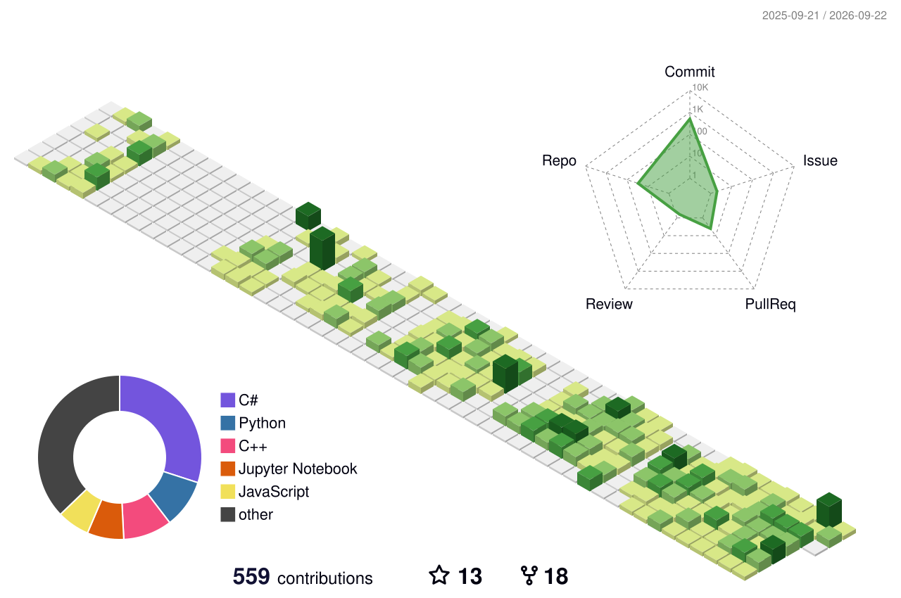

  

## 🌱 My Contribution 3D Graph

## Profile
- `Name` : Sung MyungGun (Hugo)
- `Email` : personar95@naver.com
- 🔭 I'm currently working as an **IoT instructor**
  - Major : C#, Smart Factory, IoT Development
  - Minor : Python, AI, Java, Web Dev(Spring Boot, ASP.NET, etc)
 
## GitHub Stat and Languages
<!-- username은 본인걸로 -->

  

## Using Languages

    
    
    
    
    
    
    
    
    
    
    
    
    

## Using Technics

   
    
    
    
   
   
   
  
  
  
  
  
  
  <!-- 
    
  -->

## Using Tools

  
  
  
  

<!--
## 기술명세
| 기술분류 | 설명 |
|:---:|:---:|
|VSCode | VisualStudio Code 툴 사용법 습득|
|Python | 빅데이터분석, 머신러닝, OpenCV|
-->

## Project List

### Python

- [AI] [AI 비전검사 시스템](https://github.com/hugoMGSung/iot-dotnet-2026/blob/main/TOYPROJECT4.md)
- [AI] [AI 문서검색·질의응답 시스템](https://github.com/hugoMGSung/iot-dotnet-2026/blob/main/TOYPROJECT7.md)
- [IoT] [에너지 관리 시스템](https://github.com/hugoMGSung/works-need-it-IoT/tree/main/energy_management_system)

#### Python lecture list

- [Python] [Python 강의 2024 - 1](https://github.com/hugoMGSung/basic-python-2024) 
- [Python] [Python 강의 2024 - 2](https://github.com/hugoMGSung/java-bigdata-2024) 
- [Python] [Python 강의 2025](https://github.com/hugoMGSung/iot-python-2025)
- [Python] [Python 강의 2026](https://github.com/hugoMGSung/iot-python-2026)
- [DataAnalysis] [데이터분석 강의 2024](https://github.com/hugoMGSung/Iot-bigdata-2024)
- [DataAnalysis] [데이터분석 강의 2025](https://github.com/hugoMGSung/iot-dataanalysis-2025)
- [VibeCoding] [바이브코딩 강의 2026](https://github.com/hugoMGSung/vibecodings-part2-2026/blob/main/Day01.md)

#### Python SelfStudy

- [PyTorch] [Pytorch학습](https://github.com/hugoMGSung/study-pytorch)

### C/C++

- [MFC] [MFC 강의 2026](https://github.com/hugoMGSung/iot-mfc-2026)

### C#

- [WPF] [국가교통정보센터 CCTV앱](https://github.com/hugoMGSung/iot-dotnet-2026/blob/main/TOYPROJECT1.md)
- [WinForm] [국가교통정보 CCTV앱](https://github.com/hugoMGSung/works-need-it-csharp/tree/main/miniprojects/ITS_CCTV_App)
- [WPF] [WPF프로젝트](https://github.com/hugoMGSung/works-need-it-cshap/tree/main/studyWpf/portfolio)

#### WPF Lecture list

- [WPF] [WPF 강의 2024](https://github.com/hugoMGSung/basic-wpf-2024)
- [WinApp] [WinForms/WPF 강의 2025](https://github.com/hugoMGSung/iot-winapp-2025)
- [WPF] [WPF 강의 2025](https://github.com/hugoMGSung/iot-wpf-2025)
- [DotNet] [닷넷 통합강의 2026](https://github.com/hugoMGSung/iot-dotnet-2026)

#### ASP.NET Core

- [ASP.NET] [ASP.NET 강의 2023](https://github.com/hugoMGSung/works-need-it-web/blob/main/studyASPNET2023/README.md)
- [ASP.NET] [ASP.NET 강의 2024](https://github.com/hugoMGSung/basic-aspnet-2024)
- [ASP.NET] [ASP.NET 강의 2025](https://github.com/hugoMGSung/iot-webapp-2025)

### Java

- [JavaWeb] [SpringBoot 2024](https://github.com/hugoMGSung/basic-springboot-2024)
- [JavaWeb] [SpringBoot 2025](https://github.com/hugoMGSung/java-springboot-2025)
- [JavaWeb] [SpringBoot 2026](https://github.com/hugoMGSung/java-springboot-2026)

### Database

- [Database] [SQL Server 강의 2024](https://github.com/hugoMGSung/basic-database-2024)
- [Database] [MySQL 강의 2025](https://github.com/hugoMGSung/iot-database-2025)
- [Database] [Oracle 강의 2025](https://github.com/hugoMGSung/java-database-2025)
- [Database] [MySQL 강의 2026](https://github.com/hugoMGSung/iot-database-2026)
- [Database] [Oracle 강의 2026](https://github.com/hugoMGSung/java-database-2026)

### Algorithm

- [CodingTest] [코딩테스트 강의 2025](https://github.com/hugoMGSung/iot-codingtest-2025)
- [알고리즘] [알고리즘 강의 2026](https://github.com/hugoMGSung/iot-algorithm-2026)

### ETC

- [SmartHome] [SmartHome DIY](https://github.com/hugoMGSung/hungout-with-arduino/tree/main/NewSmartHome_1_8)
- [MiniProject] [MiniProject 2025](https://github.com/hugoMGSung/iot-miniproject-2025)
- [Website] [Personal Portfolio site](https://hugoMGSung.github.io)

#### ROS2 SelfStudy

- [ROS2] [ROS2 Study](https://github.com/hugoMGSung/hugo-ros2)

